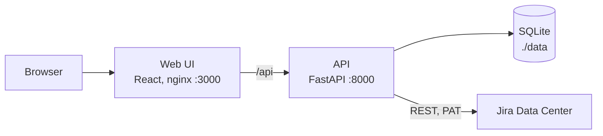

# drawhl

[](https://github.com/Smacktur/drawhl/actions/workflows/ci.yml)
[](LICENSE)
[](https://github.com/Smacktur/drawhl/releases)

> Open-source infinite canvas with live Jira Data Center task cards for leads who think spatially


## Why

**Problem.** A lead on Jira Data Center juggles dozens of tasks across projects. Filters and kanban boards give long lists with no overview: you can't put related tasks next to each other, circle a group or leave a note beside it. Whiteboards let you do that, but their Jira cards go stale and get recreated by hand, and on Data Center the integration needs OAuth set up by an admin.

**What it does.** drawhl is a self-hosted whiteboard where Jira tasks are live cards. Put them in frames, add sticky notes and arrows, and arrange the board the way you think about the work. Statuses refresh on their own while the board is open, and closed tasks are struck through. It connects with your own personal access token, without help from a Jira admin.

## Features

- Add cards by key (`SRE-121`), by link, several at once, or by JQL with suggestions from your Jira
- Frames, sticky notes, text and arrows; drag cards in and out of frames
- Statuses refresh every 30 s with one batched request per board; "Refresh all" and an "updated N s ago" indicator
- Click a card for assignee, priority, last update and a link to Jira; collapse cards to one line
- Several boards, saved on the server and reopened as you left them
- Undo and redo, copy and paste, keyboard shortcuts (press `?`), light and dark theme
- Built-in demo tasks, so you can try it without Jira

## Quick start

You need Docker with Compose. From released images, no checkout needed:

```bash
mkdir drawhl && cd drawhl
curl -fsSLO https://raw.githubusercontent.com/Smacktur/drawhl/main/compose.release.yml
docker compose -f compose.release.yml up -d
```

Or from source:

```bash
git clone https://github.com/Smacktur/drawhl.git
cd drawhl
docker compose up --build
```

Open http://localhost:3000. A fresh install uses the demo provider: add `DEMO-1` with the Jira card tool at the bottom, or type `project = DEMO` to add all twelve demo tasks.

### Connect Jira Data Center

Requires Jira Data Center or Server 8.14 or later (personal access tokens).

1. Create a `.env` file next to the compose file with a key that encrypts your token on disk:

   ```bash
   echo "DRAWHL_SECRET_KEY=$(openssl rand -base64 32)" >> .env
   ```

2. Restart: `docker compose up -d` (add `-f compose.release.yml` if you run from images).
3. In Jira, open your profile → Personal Access Tokens → Create token.
4. In drawhl, open the menu → Settings, choose the Jira provider, enter the base URL (`https://jira.example.com`) and the token, then press "Test connection". It shows your Jira name.

Keep `DRAWHL_SECRET_KEY` safe. If you change or lose it, enter the token again.

## Configuration

Everything works without a `.env` file. To override defaults, `cp .env.example .env` and edit it.

| Variable | Purpose | Default |
|---|---|---|
| `DRAWHL_SECRET_KEY` | Encrypts the Jira token at rest; needed only to connect Jira (`openssl rand -base64 32`) | unset |
| `JIRA_TLS_VERIFY` | Verify Jira's TLS certificate; `false` skips the check | `true` |
| `JIRA_CA_BUNDLE` | Path inside the container to a CA bundle for a corporate certificate authority | unset |
| `LOG_LEVEL` | Log level | `info` |
| `DB_PATH` | SQLite file inside the container | `data/app.db` |
| `APP_ENV` | Environment name: `local`, `stage` or `production` | `local` |

To trust a corporate CA, put the bundle in `./data` (for example `data/corp-ca.pem`) and set `JIRA_CA_BUNDLE=data/corp-ca.pem`.

The refresh interval is set in Settings, not in the environment.

## Data, backups and upgrades

All data is one SQLite file in `./data`, which survives rebuilds and upgrades.

- **Back up:** copy `data/app.db` while the stack is stopped. From a source checkout, `make backup` copies it to `data/backups/` with a timestamp and keeps the newest 20; `make up` runs it before every rebuild.
- **Restore:** stop the stack and copy a backup over `data/app.db`.
- **Upgrade from images:** `docker compose -f compose.release.yml pull && docker compose -f compose.release.yml up -d`. Pin a version with `TAG=2026.10.5`.
- **Upgrade from source:** `git pull && docker compose up --build -d`.

## Hosting and security

drawhl is a single-user app and **has no login**. Anyone who can open its URL sees your boards and can search Jira with your token. Run it on your own machine or home network, or reach it through a VPN such as Tailscale. If you expose it beyond that, put it behind a reverse proxy that adds authentication.

Your Jira Data Center is usually reachable only from the corporate network, so the host running drawhl must be able to reach it too.

The token is stored only on the server, encrypted with `DRAWHL_SECRET_KEY`. It is never sent back to the browser or written to logs. Report vulnerabilities as described in [SECURITY.md](SECURITY.md).

## Privacy

drawhl runs on your infrastructure and sends no telemetry. It stores your boards, your settings, the encrypted Jira token and a cached copy of each card's key, summary, status, type, assignee, priority and last update. The only external service it talks to is the Jira URL you configure. Fonts and icons ship with the app.

## Limitations

drawhl is for one person keeping track of their own work. Not planned for now:

- Real-time collaboration, board sharing, accounts and roles
- Jira Cloud, Confluence and other trackers (the provider interface leaves room for them)
- Changing status or editing a task from the board; Jira stays the source of truth
- Jira webhooks; statuses come from polling the open board
- Freehand drawing and shapes beyond frames and sticky notes
- Mobile layout and languages other than English

## Architecture



Details: [docs/architecture.md](docs/architecture.md). Stack: Python 3.12, FastAPI, React, TypeScript, `@xyflow/react`, Vite, Docker Compose.

## Contributing

Bug reports, ideas and pull requests are welcome. Start with [CONTRIBUTING.md](CONTRIBUTING.md). Everyone follows the [Code of Conduct](CODE_OF_CONDUCT.md).

```bash
make up       # whole stack in Docker
make check    # lint + tests
make help     # all commands
```

## License

[MIT](LICENSE) © The drawhl Authors. Third-party components: [THIRD_PARTY.md](THIRD_PARTY.md).
