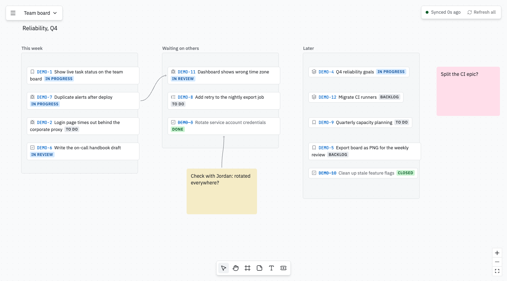
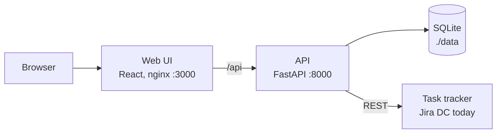

<h1 align="center">
  <picture>
    <source media="(prefers-color-scheme: dark)" srcset="brand/social/readme-banner-dark.svg">
    
  </picture>
</h1>

<p align="center">
  <a href="#-quick-start"><b>Quick start</b></a> •
  <a href="https://tiko-run.github.io/tiko/"><b>Docs</b></a> •
  <a href="#-features"><b>Features</b></a> •
  <a href="#-task-trackers"><b>Trackers</b></a> •
  <a href="#%EF%B8%8F-roadmap"><b>Roadmap</b></a> •
  <a href="docs/architecture.md"><b>Architecture</b></a>
</p>

<p align="center">
  <a href="https://github.com/tiko-run/tiko/actions/workflows/ci.yml"></a>
  <a href="LICENSE"></a>
  <a href="https://github.com/tiko-run/tiko/releases"></a>
  <a href="https://tiko-run.github.io/tiko/"></a>
</p>



tiko is an open-source, self-hosted whiteboard where the tasks from your tracker live as cards. Put them in frames, circle a group, leave a sticky note beside it and draw arrows between them. Statuses update on their own while the board is open, so the board stays true without manual upkeep.

It is for people who keep a lot of work in their head and think spatially: leads, managers, anyone juggling tasks across projects. Lists and kanban boards show a long column; tiko lets you lay the same tasks out the way you think about them.

The [user guide](https://tiko-run.github.io/tiko/) covers every feature and how to self-host tiko.

> tiko is young. Jira Data Center is the first tracker; Linear, Plane, Todoist and others are next. Ideas and bug reports are welcome in [issues](https://github.com/tiko-run/tiko/issues).

## 🚀 Quick start

You need Docker with Compose, or a Railway or Render account for the cloud options below. From released images, no checkout needed:

```bash
mkdir tiko && cd tiko
curl -fsSLO https://raw.githubusercontent.com/tiko-run/tiko/main/compose.release.yml
docker compose -f compose.release.yml up -d
```

Or from source:

```bash
git clone https://github.com/tiko-run/tiko.git
cd tiko
docker compose up --build
```

Or in the cloud, on Railway or Render:

[](https://railway.com/deploy/tiko?referralCode=wFuy8y&utm_medium=integration&utm_source=button&utm_campaign=tiko) [](https://render.com/deploy?repo=https://github.com/tiko-run/tiko)

Both run the released images with your boards on a disk and generate the encryption key and the password. The app opens on the URL the platform gives you; sign in as `admin` with `TIKO_PASSWORD` from the `api` service's Variables on Railway, or the `tiko-api` service's Environment on Render. Render needs paid instances for the disk, about $15 a month for both. A tracker inside a corporate network is out of reach from there.

On your machine, open http://localhost:3000 and sign in as `admin` with the password from the log: `docker compose logs api | grep 'tiko password'`, or `cat data/password` from a source checkout. To pick your own, set `TIKO_PASSWORD` in `.env`. A fresh install opens on a sample board built from demo tasks: move things around, then add more with the card tool at the bottom (`DEMO-5`, or `project = DEMO` for all twelve). Delete the board when you are done with it. Next steps are in the [quick start guide](https://tiko-run.github.io/tiko/quick-start/).

## 🌟 Features

- **Live task cards.** Each card shows type, key, title and status from your tracker. Statuses refresh every 30 s with one batched request per board, and closed tasks are struck through. A colored dot in the corner shows whether every tracker syncs and, on click, why one fails.
- **Fast ways to add tasks.** By key (`DEV-12`), by link, several at once, or by query (JQL in Jira) with suggestions for fields and values. Or just paste: links copied from your tracker tabs become cards, any other text becomes a note. New cards land in a neat grid.
- **A real whiteboard.** Frames, sticky notes, text and arrows, which can also point at an empty spot. Drag cards in and out of frames; moving a frame moves everything inside. Smart guides snap what you drag or resize to the edges, centers and gaps of its neighbors, and long text in a sticky note shrinks to fit.
- **Details on demand.** Click a card for assignee, priority, last update and a link to the task. Collapse cards to one line when the board gets busy.
- **Gantt module.** The first board module. Drop cards onto a timeline to plan them as bars with live status, nest them into stages, mark milestones and draw dependency lines that turn amber when a task starts too early. Plan dates stay on the board.
- **Timers.** Put a small countdown cube next to a card you are waiting on, with a note on what for. It goes off after a set time or as soon as the task leaves its status in the tracker, with a browser notification and a chime while tiko is open. Timers move and disappear with their card, and a list in the top bar shows every timer on the board.
- **Focus timer.** A pomodoro capsule at the top of the screen: 25 minutes of focus, 5 minute breaks and a long one after every fourth round, with a chime and a browser notification at the end. Its color warms from green to raspberry as the time runs out. Lengths are adjustable, and the countdown survives a reload. Under the timer, a small player with seven built-in lofi tracks (CC0) or your own audio files, kept in your browser; it can pause itself on breaks.
- **Several boards.** Saved on the server and reopened exactly as you left them.
- **Search.** `⌘K` finds any text on the board, cards by key, title, status or assignee included, and moves the board to it. Filters like `@anna` or `status:review`, and app commands and other boards in the same palette.
- **Keyboard first.** Undo and redo, copy and paste, duplicate, shortcuts for every tool (press `?`), light and dark theme.
- **Yours to keep.** One SQLite file, no telemetry, no account, no cloud. The About panel tells you when a new release is out.

## 🔌 Task trackers

tiko talks to trackers through one provider interface, so adding a new one doesn't touch the board.

| Tracker | Status |
|---|---|
| Demo tasks (built in) | Available |
| Jira Data Center and Server 8.14+ | Available |
| Jira Cloud | Planned |
| Linear | Planned |
| Plane | Planned |
| Todoist | Planned |
| TickTick | Planned |
| Windshift | Planned |

### Connect Jira Data Center

tiko uses your own personal access token, so a Jira admin doesn't need to set anything up.

1. Create a `.env` file next to the compose file with a key that encrypts your token on disk:

   ```bash
   echo "TIKO_SECRET_KEY=$(openssl rand -base64 32)" >> .env
   ```

2. Restart: `docker compose up -d` (add `-f compose.release.yml` if you run from images).
3. In Jira, open your profile → Personal Access Tokens → Create token.
4. In tiko, an admin opens Settings → Task source (main menu or `⌘,`), chooses the Jira provider and enters the base URL (`https://jira.example.com`). Each person then pastes their own token in Settings → My tracker and presses "Test connection". It shows their Jira name, and cards show each person only what their own Jira access allows.

Keep `TIKO_SECRET_KEY` safe. If you change or lose it, enter the token again. Corporate certificates and other details: [Jira Data Center guide](https://tiko-run.github.io/tiko/jira-data-center/).

## 🗺️ Roadmap

What we plan next, roughly in order. Want something sooner or missing here? Open an issue.

**Access and hosting**

- Optional password login, so tiko can run on a public server
- Accounts and shared boards for a team

**More trackers**

- Jira Cloud, Linear, Plane, Todoist, TickTick, Windshift

**AI, opt-in and with your own key**

- Bring your own model: OpenRouter, Claude, OpenAI or a local one
- Turn a sticky note into a task in your tracker
- MCP server, so AI agents can read your boards and arrange cards
- Voice notes with a local speech model

**Board**

- Collection pins: drop a pin and pull matching tasks to it in a grid, by query or by a word in the title
- Subtasks, linked tasks and epic children, unfolded right from a card
- "Blocks" and "depends on" links next to plain arrows
- Task lists and tables from a query, with paging
- Images, GIFs, video and YouTube embeds

**Staying on top**

- Comment counter on cards and a badge for new comments since your last visit
- Reminders on a card, delivered in the app, then by email, Telegram, Slack or Mattermost
- Live blocks from other tools, such as Grafana charts and Metabase numbers

## ⚙️ Configuration

Everything works without a `.env` file. To override defaults, `cp .env.example .env` and edit it.

| Variable | Purpose | Default |
|---|---|---|
| `TIKO_PASSWORD` | Password of the first account, `admin`. When empty, one is generated on first start, printed once to the API log and saved to `data/password`. Not read once the account exists | generated |
| `TIKO_SECRET_KEY` | Encrypts tracker tokens at rest; needed only to connect a tracker (`openssl rand -base64 32`) | unset |
| `TIKO_TRACKER` | Tracker for everyone: `demo` or `jira`. Set, Settings → Task source shows it read-only | set in Settings |
| `JIRA_BASE_URL` | Jira URL for everyone, like `https://jira.example.com`; a wrong URL stops the start. Each person still adds their own token | set in Settings |
| `JIRA_TLS_VERIFY` | Verify Jira's TLS certificate; `false` skips the check | `true` |
| `JIRA_CA_BUNDLE` | Path inside the container to a CA bundle for a corporate certificate authority | unset |
| `LOG_LEVEL` | Log level | `info` |
| `DB_PATH` | SQLite file inside the container | `data/app.db` |
| `APP_ENV` | Environment name: `local`, `stage` or `production` | `local` |
| `UPDATE_CHECK` | Ask GitHub every 6 hours for the latest release to show "update available" in About; `false` turns it off | `true` |

To trust a corporate CA, put the bundle in `./data` (for example `data/corp-ca.pem`) and set `JIRA_CA_BUNDLE=data/corp-ca.pem`.

The refresh interval is set in Settings → Task source, not in the environment.

## 💾 Data, backups and upgrades

All data is one SQLite file in `./data`, which survives rebuilds and upgrades.

- **Back up:** copy `data/app.db` while the stack is stopped. From a source checkout, `make backup` copies it to `data/backups/` with a timestamp and keeps the newest 20; `make up` runs it before every rebuild.
- **Restore:** stop the stack and copy a backup over `data/app.db`.
- **Upgrade from images:** `docker compose -f compose.release.yml pull && docker compose -f compose.release.yml up -d`. Pin a version with `TAG=2026.10.6`.
- **Upgrade from source:** `git pull && docker compose up --build -d`.

More in the [data and upgrades guide](https://tiko-run.github.io/tiko/data-and-upgrades/).

## 🛡️ Security and privacy

Every page and API route except `/health` and `/ready` asks you to sign in, `/metrics` included. The first account is `admin` with the password from `TIKO_PASSWORD` or `data/password`; after that, change it in Settings → Security. Passwords are stored as salted scrypt hashes. A sign-in lasts 30 days in that browser, and "Sign out everywhere" ends every session. After 10 wrong passwords for one username in 15 minutes sign-in for it pauses. Admins invite people with one-time links in Settings → People, and each board is shared with "Share" in the top bar (can edit, can view, or everyone); a locked-out admin gets a reset link with `docker compose exec api python -m app.reset_password admin`. On the open internet use HTTPS, which Railway and Render give you.

Jira Data Center is usually reachable only from the corporate network, so the host running tiko must be able to reach it too.

The token is stored only on the server, encrypted with `TIKO_SECRET_KEY`. It is never sent back to the browser or written to logs. tiko sends no telemetry: it stores your boards, settings, the encrypted token and a cached copy of each card's key, summary, status, type, assignee, priority and last update, and talks only to the tracker URL you configure and, unless `UPDATE_CHECK=false`, to the GitHub API for the latest tiko release (no data about you or your boards is sent). Fonts and icons ship with the app.

Report vulnerabilities privately as described in [SECURITY.md](SECURITY.md), not in a public issue.

## 🚧 Current limits

- One person, one instance: no real-time collaboration yet
- The tracker stays the source of truth: tiko doesn't change status or edit tasks
- Statuses come from polling the open board, not webhooks
- Desktop only, English only

## 🏗️ Architecture



Details: [docs/architecture.md](docs/architecture.md).

[](https://www.python.org/)
[](https://fastapi.tiangolo.com/)
[](https://react.dev/)
[](https://www.typescriptlang.org/)
[](https://reactflow.dev/)
[](https://sqlite.org/)
[](https://docs.docker.com/compose/)

## 🤝 Contributing

Bug reports, ideas and pull requests are welcome, and a new tracker provider is a great first contribution. Start with [CONTRIBUTING.md](CONTRIBUTING.md). On your first pull request a bot asks you to sign the [CLA](CLA.md), once. Everyone follows the [Code of Conduct](CODE_OF_CONDUCT.md).

```bash
make up       # whole stack in Docker
make check    # lint + tests
make help     # all commands
```

## 📝 License

[GNU AGPL v3](LICENSE) (`AGPL-3.0-only`) © The tiko Authors. Third-party components: [THIRD_PARTY.md](THIRD_PARTY.md).

- Anyone may use, self-host and modify tiko, privately or inside a company, for free.
- If you change tiko and let people use the changed version over a network, you must offer them its source code under the same license.
- The name and logo are not covered by the license: see [TRADEMARKS.md](TRADEMARKS.md).
- Need other terms, for example to embed tiko in a closed product? Email smacktur@gmail.com.

Releases up to and including `v2026.10.6` were published under the MIT License and stay available under it.
