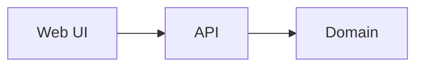

# drawhl

[](https://github.com/Smacktur/drawhl/actions/workflows/ci.yml)
[](LICENSE)
[](https://github.com/Smacktur/drawhl/releases)

> Open-source infinite canvas with live Jira Data Center task cards for leads who think spatially

TODO: one screenshot or GIF of the core scenario.

## Why

**Problem.** TODO: who struggles and why.

**What it does.** TODO: 2–3 sentences.

## Quick start

From released images, no checkout needed:

```bash
curl -fsSLO https://raw.githubusercontent.com/Smacktur/drawhl/main/compose.release.yml
docker compose -f compose.release.yml up -d
```

From source:

```bash
git clone https://github.com/Smacktur/drawhl.git
cd drawhl
docker compose up --build
```

Open http://localhost:3000.

## Configuration

Works without a `.env` file. To override defaults: `cp .env.example .env`.

| Variable | Purpose | Default |
|---|---|---|
| `LOG_LEVEL` | Log level | `info` |

Data lives in `./data` (SQLite); back it up to keep your state.

## Privacy

drawhl runs on your infrastructure and sends no telemetry. TODO: what it stores and which external services it talks to.

## Architecture



Details: [docs/architecture.md](docs/architecture.md). Stack: Python 3.12, FastAPI, React, TypeScript, Vite, Docker Compose.

## Roadmap and limitations

- TODO: from Won't in the brief.

## Contributing

Bug reports, ideas and pull requests are welcome — start with [CONTRIBUTING.md](CONTRIBUTING.md). Security issues: [SECURITY.md](SECURITY.md). Everyone follows the [Code of Conduct](CODE_OF_CONDUCT.md).

```bash
make up       # whole stack in Docker
make check    # lint + tests
make help     # all commands
```

## License

[MIT](LICENSE) © The drawhl Authors. Third-party components: [THIRD_PARTY.md](THIRD_PARTY.md).
