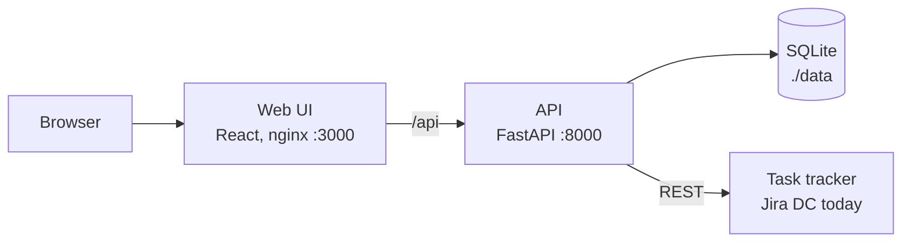

<h1 align="center">drawhl</h1>

<p align="center"><b>An infinite canvas for your tasks</b></p>

<p align="center">
  <a href="#-quick-start"><b>Quick start</b></a> •
  <a href="#-features"><b>Features</b></a> •
  <a href="#-task-trackers"><b>Trackers</b></a> •
  <a href="#%EF%B8%8F-roadmap"><b>Roadmap</b></a> •
  <a href="docs/architecture.md"><b>Architecture</b></a>
</p>

<p align="center">
  <a href="https://github.com/Smacktur/drawhl/actions/workflows/ci.yml"></a>
  <a href="LICENSE"></a>
  <a href="https://github.com/Smacktur/drawhl/releases"></a>
</p>


drawhl is an open-source, self-hosted whiteboard where the tasks from your tracker live as cards. Put them in frames, circle a group, leave a sticky note beside it and draw arrows between them. Statuses update on their own while the board is open, so the board stays true without manual upkeep.

It is for people who keep a lot of work in their head and think spatially: leads, managers, anyone juggling tasks across projects. Lists and kanban boards show a long column; drawhl lets you lay the same tasks out the way you think about them.

> drawhl is young. Jira Data Center is the first tracker; Linear, Plane, Todoist and others are next. Ideas and bug reports are welcome in [issues](https://github.com/Smacktur/drawhl/issues).

## 🚀 Quick start

You need Docker with Compose. From released images, no checkout needed:

```bash
mkdir drawhl && cd drawhl
curl -fsSLO https://raw.githubusercontent.com/Smacktur/drawhl/main/compose.release.yml
docker compose -f compose.release.yml up -d
```

Or from source:

```bash
git clone https://github.com/Smacktur/drawhl.git
cd drawhl
docker compose up --build
```

Open http://localhost:3000. A fresh install runs on built-in demo tasks: pick the card tool at the bottom and add `DEMO-1`, or type `project = DEMO` to add all twelve.

## 🌟 Features

- **Live task cards.** Each card shows type, key, title and status from your tracker. Statuses refresh every 30 s with one batched request per board, and closed tasks are struck through.
- **Fast ways to add tasks.** By key (`DEV-12`), by link, several at once, or by query (JQL in Jira) with suggestions for fields and values. New cards land in a neat grid.
- **A real whiteboard.** Frames, sticky notes, text and arrows. Drag cards in and out of frames; moving a frame moves everything inside.
- **Details on demand.** Click a card for assignee, priority, last update and a link to the task. Collapse cards to one line when the board gets busy.
- **Gantt module.** Drop cards onto a timeline to plan them as bars with live status, nest them into stages, mark milestones and draw dependency lines that turn amber when a task starts too early. Plan dates stay on the board.
- **Timers.** Put a small countdown cube next to a card you are waiting on, with a note on what for. It goes off with a browser notification and a chime while drawhl is open, and moves and disappears with its card.
- **Focus timer.** A pomodoro capsule at the top of the screen: 25 minutes of focus, 5 minute breaks and a long one after every fourth round, with a chime and a browser notification at the end. Its color warms from green to raspberry as the time runs out. Lengths are adjustable, and the countdown survives a reload. Under the timer, a small player with seven built-in lofi tracks (CC0) or your own audio files, kept in your browser; it can pause itself on breaks.
- **Several boards.** Saved on the server and reopened exactly as you left them.
- **Search.** `⌘K` finds any text on the board, cards by key, title, status or assignee included, and moves the board to it. Filters like `@anna` or `status:review`, and app commands and other boards in the same palette.
- **Keyboard first.** Undo and redo, copy and paste, duplicate, shortcuts for every tool (press `?`), light and dark theme.
- **Yours to keep.** One SQLite file, no telemetry, no account, no cloud.

## 🔌 Task trackers

drawhl talks to trackers through one provider interface, so adding a new one doesn't touch the board.

| Tracker | Status |
|---|---|
| Demo tasks (built in) | Available |
| Jira Data Center and Server 8.14+ | Available |
| Jira Cloud | Planned |
| Linear | Planned |
| Plane | Planned |
| Todoist | Planned |
| TickTick | Planned |
| Windshift | Planned |

### Connect Jira Data Center

drawhl uses your own personal access token, so a Jira admin doesn't need to set anything up.

1. Create a `.env` file next to the compose file with a key that encrypts your token on disk:

   ```bash
   echo "DRAWHL_SECRET_KEY=$(openssl rand -base64 32)" >> .env
   ```

2. Restart: `docker compose up -d` (add `-f compose.release.yml` if you run from images).
3. In Jira, open your profile → Personal Access Tokens → Create token.
4. In drawhl, open the menu → Settings, choose the Jira provider, enter the base URL (`https://jira.example.com`) and the token, then press "Test connection". It shows your Jira name.

Keep `DRAWHL_SECRET_KEY` safe. If you change or lose it, enter the token again.

## 🗺️ Roadmap

What we plan next, roughly in order. Want something sooner or missing here? Open an issue.

**Access and hosting**

- Optional password login, so drawhl can run on a public server
- One-click deploy to Render and similar hosts
- Accounts and shared boards for a team

**More trackers**

- Jira Cloud, Linear, Plane, Todoist, TickTick, Windshift

**AI, opt-in and with your own key**

- Bring your own model: OpenRouter, Claude, OpenAI or a local one
- Turn a sticky note into a task in your tracker
- MCP server, so AI agents can read your boards and arrange cards
- Voice notes with a local speech model

**Board**

- Collection pins: drop a pin and pull matching tasks to it in a grid, by query or by a word in the title
- Subtasks, linked tasks and epic children, unfolded right from a card
- "Blocks" and "depends on" links next to plain arrows
- Task lists and tables from a query, with paging
- Images, GIFs, video and YouTube embeds

**Staying on top**

- Comment counter on cards and a badge for new comments since your last visit
- Reminders on a card, delivered in the app, then by email, Telegram, Slack or Mattermost
- Live blocks from other tools, such as Grafana charts and Metabase numbers

## ⚙️ Configuration

Everything works without a `.env` file. To override defaults, `cp .env.example .env` and edit it.

| Variable | Purpose | Default |
|---|---|---|
| `DRAWHL_SECRET_KEY` | Encrypts tracker tokens at rest; needed only to connect a tracker (`openssl rand -base64 32`) | unset |
| `JIRA_TLS_VERIFY` | Verify Jira's TLS certificate; `false` skips the check | `true` |
| `JIRA_CA_BUNDLE` | Path inside the container to a CA bundle for a corporate certificate authority | unset |
| `LOG_LEVEL` | Log level | `info` |
| `DB_PATH` | SQLite file inside the container | `data/app.db` |
| `APP_ENV` | Environment name: `local`, `stage` or `production` | `local` |
| `UPDATE_CHECK` | Ask GitHub every 6 hours for the latest release to show "update available" in About; `false` turns it off | `true` |

To trust a corporate CA, put the bundle in `./data` (for example `data/corp-ca.pem`) and set `JIRA_CA_BUNDLE=data/corp-ca.pem`.

The refresh interval is set in Settings, not in the environment.

## 💾 Data, backups and upgrades

All data is one SQLite file in `./data`, which survives rebuilds and upgrades.

- **Back up:** copy `data/app.db` while the stack is stopped. From a source checkout, `make backup` copies it to `data/backups/` with a timestamp and keeps the newest 20; `make up` runs it before every rebuild.
- **Restore:** stop the stack and copy a backup over `data/app.db`.
- **Upgrade from images:** `docker compose -f compose.release.yml pull && docker compose -f compose.release.yml up -d`. Pin a version with `TAG=2026.10.6`.
- **Upgrade from source:** `git pull && docker compose up --build -d`.

## 🛡️ Security and privacy

drawhl is a single-user app and **has no login yet**. Anyone who can open its URL sees your boards and can search your tracker with your token. Run it on your own machine or home network, or reach it through a VPN such as Tailscale. If you expose it beyond that, put it behind a reverse proxy that adds authentication.

Jira Data Center is usually reachable only from the corporate network, so the host running drawhl must be able to reach it too.

The token is stored only on the server, encrypted with `DRAWHL_SECRET_KEY`. It is never sent back to the browser or written to logs. drawhl sends no telemetry: it stores your boards, settings, the encrypted token and a cached copy of each card's key, summary, status, type, assignee, priority and last update, and talks only to the tracker URL you configure and, unless `UPDATE_CHECK=false`, to the GitHub API for the latest drawhl release (no data about you or your boards is sent). Fonts and icons ship with the app.

Report vulnerabilities privately as described in [SECURITY.md](SECURITY.md), not in a public issue.

## 🚧 Current limits

- One person, one instance: no real-time collaboration yet
- The tracker stays the source of truth: drawhl doesn't change status or edit tasks
- Statuses come from polling the open board, not webhooks
- Desktop only, English only

## 🏗️ Architecture



Details: [docs/architecture.md](docs/architecture.md).

[](https://www.python.org/)
[](https://fastapi.tiangolo.com/)
[](https://react.dev/)
[](https://www.typescriptlang.org/)
[](https://reactflow.dev/)
[](https://sqlite.org/)
[](https://docs.docker.com/compose/)

## 🤝 Contributing

Bug reports, ideas and pull requests are welcome, and a new tracker provider is a great first contribution. Start with [CONTRIBUTING.md](CONTRIBUTING.md). Everyone follows the [Code of Conduct](CODE_OF_CONDUCT.md).

```bash
make up       # whole stack in Docker
make check    # lint + tests
make help     # all commands
```

## 📝 License

[MIT](LICENSE) © The drawhl Authors. Third-party components: [THIRD_PARTY.md](THIRD_PARTY.md).
