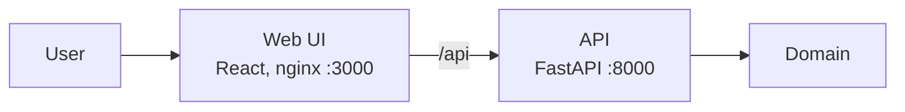

# Architecture

## Сейчас

Слои: `api → domain ← adapters`, wiring в `backend/app/main.py`. Подробно — [playbook/03-architecture.md](playbook/03-architecture.md).

## Если взлетит

TODO: что меняется при росте нагрузки (реплики API, Postgres, очередь, кеш) — показываем, а не строим.
