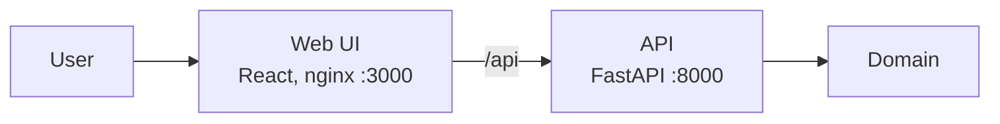

# Architecture

## Now

Layers: `api → domain ← adapters`, wiring in `backend/app/main.py`. Details: [playbook/03-architecture.md](playbook/03-architecture.md).

## If it takes off

TODO: what changes as load grows (API replicas, Postgres, queue, cache) — shown here, not built.
