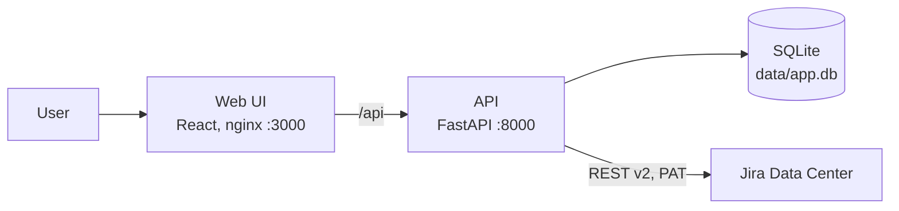
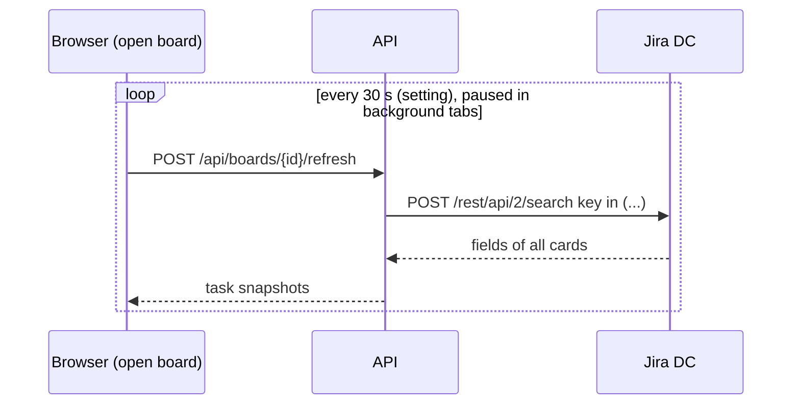

# Architecture

## Now



Two containers. nginx serves the built UI and proxies `/api` to the API, so the browser sees one origin. The API keeps everything in one SQLite file under `./data`. Layers: `api → domain ← adapters`, wiring in `backend/app/main.py`. Details: [playbook/03-architecture.md](playbook/03-architecture.md); the reasons behind each choice are in [decisions.md](decisions.md).

### Backend

```text
backend/app/
  api/        routes: boards, tasks, jql, settings, demo; error mapping to HTTP
  domain/     boards, tasks, refresh and backoff, jql, settings; ports.py
  adapters/
    tasks/    jira_dc.py (httpx), demo.py (in-memory seed)
    storage/  sqlite.py, migrations/*.sql (PRAGMA user_version)
    secrets/  fernet.py (token encryption with DRAWHL_SECRET_KEY)
  config.py   ENV, the single entry point
```

Ports in `domain/ports.py`: `TaskProvider` (`resolve`, `poll`, `search`, `check`, JQL vocabulary and values), `BoardRepo`, `SnapshotRepo`, `SettingsRepo`, `SecretBox`. The provider is a runtime setting (`demo` or `jira`), so connecting Jira needs no restart.

Tables: `boards` (one JSON doc per board with a `version` for compare-and-set saves), `task_snapshots` (latest fields per issue key), `settings` (provider, Jira URL, encrypted token, refresh interval).

`/health` and `/metrics` (Prometheus) are served outside `/api`.

### Frontend

```text
frontend/src/
  api/        fetch client, zod schemas
  board/      top bar, board menu, shortcuts dialog
  canvas/     React Flow canvas, nodes/, toolbar, context menu, clipboard, undo history
  settings/   Jira connection sheet
  components/ui/  shadcn components
  lib/        theme, shortcuts registry, JQL helpers
```

The board is held in React Flow state and saved as a whole doc after a short debounce. A `409` on save means another tab saved first.

### Status refresh



One batched request per open board per tick. The response lists every tracker with its own state (`sources`), so one failing tracker never hides the others. Backoff lives on the server, per tracker: rate limits and 5xx double the wait (honours `Retry-After`, up to 300 s); network errors retry at the normal interval, so a VPN coming back shows up on the next tick. The client polls at the interval, or at `retry_after` when a tracker asked to wait.

## If it takes off

Not built; shown here so the current design does not block it.

- **Several users:** add authentication in front of the API (reverse proxy or OIDC), then a `user_id` on boards and settings. Each user keeps their own token.
- **More load:** move from SQLite to Postgres behind the same repo ports, run several API replicas, and share refresh results between boards that show the same keys.
- **Fewer requests to Jira:** a server-side poller with a cache per key, or webhooks where admins allow them.
- **Other trackers:** a new `TaskProvider` adapter (Jira Cloud, Todoist) without changes to the domain.
